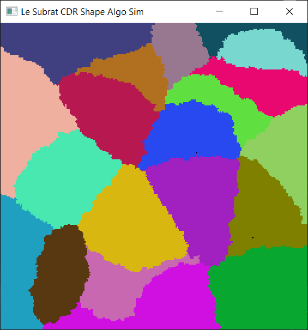
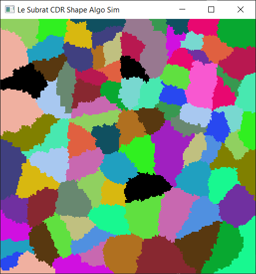
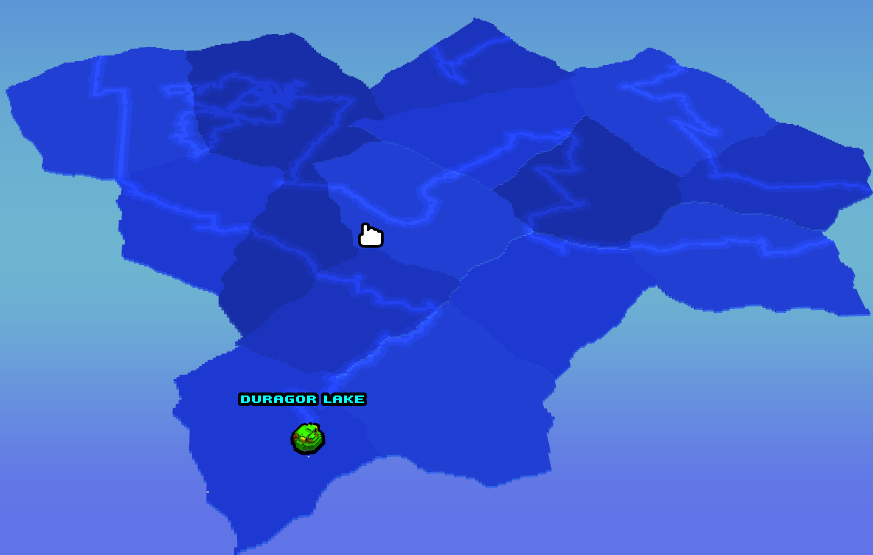
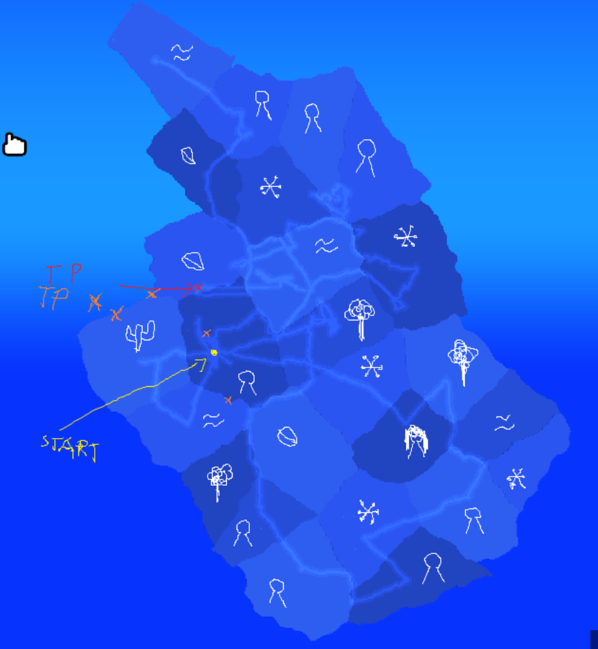

# LS-CDR-ShapeAlgo

## Description

Cellular automata that makes shapes. Uses SFML and C++20.

## Results

Here are the shapes generated with 20 and 100 "blobs" respectively.
 

## Goal

I wanted to make an algorithm that generated shapes like these:
 

